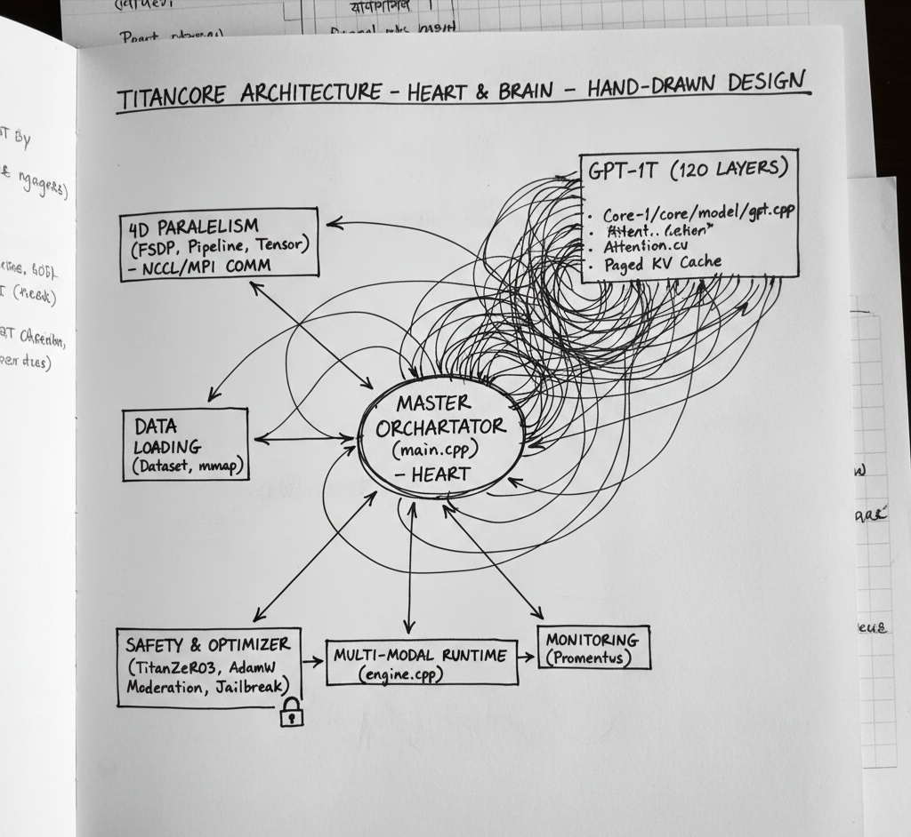

# 🚀 TitanCore: Core-1 (Next-Gen Distributed Neural Engine)

### "Empowering Sovereign AI with Trillion-Parameter Scalability"

TitanCore **Core-1** is an ultra-scalable, distributed neural network architecture designed to handle models up to **1 Trillion parameters**. This project stands as a testament to the fact that **innovation is not limited by hardware, but by the strength of one's will.**

---

## 🏗️ The Mobile-First Revolution
Breaking the myth that AI development requires high-end workstations, this entire engine was architected and coded on a mobile device:
* **Development Device:** Vivo 1816 (Smartphone)
* **Environment:** [Termux](https://termux.dev/) & [Acode Editor](https://acode.app/)
* **Initial Release:** 8th February 2026

---

## ⚠️ Project Status & Tokenization
* **Training Status:** Structural framework established. (Current version: Inference-ready/Structural).
* **Tokenization:** Custom `vocab.json` + `merges.txt` with a massive vocabulary of **~400,000 tokens**.
* **Inference:** Optimized for specialized fast GPU execution.

---

## 🗺️ High-Level Blueprint
The architecture focuses on a decentralized processing model, ensuring that massive computational loads are sharded effectively across distributed nodes.



---

## 🏗️ Technical Architecture Details

### 1. 120-Layer Transformer Backbone
The engine utilizes a deep **Transformer architecture** featuring 120 layers, optimized for:
* **High-Speed Reasoning:** Minimized latency via FlashAttention.
* **Complex Logic:** Deep neural pathways for advanced problem solving.

### 2. 4D Parallelism & TitanZero-3
* **4D Parallelism:** Integrates Data, Pipeline, Tensor, and Expert parallelism.
* **TitanZero-3:** Shards optimizer states and parameters to minimize VRAM footprint.

### 3. Hardware Acceleration & Precision
* **Acceleration:** Native FlashAttention CUDA kernels.
* **Precision Support:** FP32, FP16, INT8, and INT4 (Quantization ready).
* **Format:** Supports **GGUF** (`titancore.gguf`) for efficient deployment.

---

## 📂 Project Structure
| Component | Responsibility | Technical Stack |
| :--- | :--- | :--- |
| **Main Orchestrator** | Node sync & Global state | `main.cpp` |
| **Neural Engine** | Forward/Backward logic | `engine.cpp` |
| **CUDA Kernels** | Optimized matrix operations | `attention.cu` |
| **Safety Guard** | Jailbreak & Bias mitigation | `prometheus_guard.cpp` |

---

## 🚀 Getting Started

### Prerequisites
* **CMake 3.18+**
* **CUDA Toolkit**
* **C++17 Compiler**
* **NVIDIA GPU** (Note: CPU is currently NOT supported)

### Build
```bash
git clone [https://github.com/litonsarkar3988-max/Core-1](https://github.com/litonsarkar3988-max/Core-1)
cd Core-1
mkdir build && cd build
cmake ..
make -j$(nproc)
Run (GPU Only)
Bash

./main --model ../weights/titancore.gguf --config ../configs/gpt4o.yaml
🌟 A Message to Every Dreamer
"You don't need expensive gear or high-end servers to build something great. If you have the passion and the grit, you can architect world-class technology using just a basic smartphone and Termux. Limitations exist only in the mind, not in the tools we hold."

👤 Author
Rahul Sarkar — India 🇮🇳

Personal AI research project developed entirely on mobile.

⚠️ Disclaimer: This is an experimental research project. GPU is mandatory for inference.
